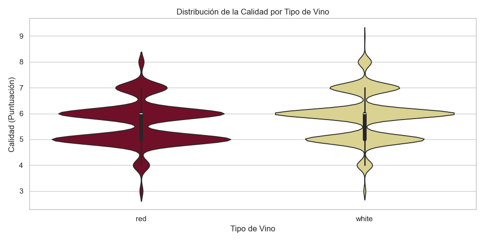
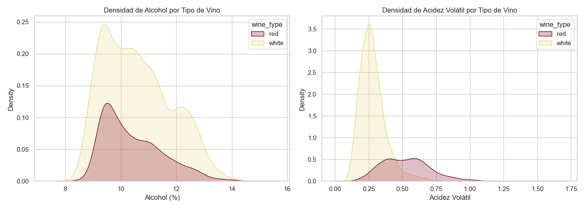
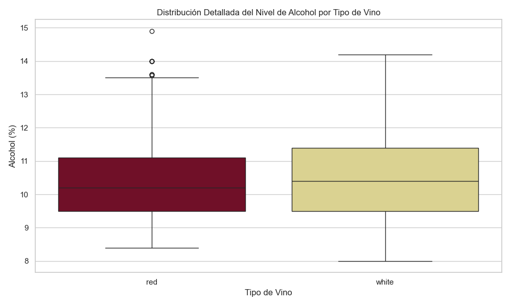

# Análisis Comparativo por Tipo de Vino

A partir de los datos limpios almacenados en `datos/procesados/winequality_cleaned.csv`, hemos extraído insights clave sobre las diferencias entre el vino tinto y el vino blanco. 

A continuación presento las gráficas generadas y su interpretación:

## 1. Distribución de Calidad

> **Interpretación**: 
> Este gráfico de violín muestra cómo se distribuyen las calificaciones para ambos tipos de vino. Como podemos ver, ambas curvas son muy gruesas en la calificación de **6**, indicando que la mayoría de los vinos (tanto blancos como tintos) reciben una puntuación estándar o promedio. Sin embargo, el vino blanco tiene una concentración ligeramente más alta en puntuaciones de **7** y **8** (las partes superiores son más gruesas), sugiriendo que hay proporcionalmente más vinos blancos de alta calidad en este dataset en comparación con el tinto.

## 2. Diferencias Químicas Clave

> **Interpretación**:
> * **Alcohol**: Ambos vinos tienen una concentración de alcohol con distribución muy similar (el pico principal para ambos está entre 9% y 10%). Las densidades se superponen casi por completo.
> * **Acidez Volátil**: Aquí hay una **diferencia drástica**. El vino blanco tiene niveles de acidez volátil muchísimo más bajos y concentrados que el vino tinto. Dado que el diccionario de datos indica que altos niveles de este ácido pueden dar sabor a vinagre, esto confirma que los vinos blancos se producen con controles de acidez volátil mucho más estrictos para mantener su perfil fresco, mientras que los vinos tintos, por su naturaleza tánica y robusta, tienden a poseer niveles más altos.

## 3. Análisis Detallado del Nivel de Alcohol

> **Interpretación**:
> Al analizar los datos estadísticos, encontramos que el **vino blanco tiene un porcentaje promedio de alcohol levemente superior (10.59%)** en comparación con el vino tinto (10.43%). Sin embargo, curiosamente es el **vino tinto el que registra el valor atípico más extremo en todo el dataset llegando a un 14.9%** (frente al 14.2% máximo del blanco). 
> 
> A pesar de estas pequeñas variaciones, la conclusión clave es que **el alcohol NO es un factor primario de diferenciación entre el vino blanco y tinto**. Si observamos los cuartiles, vemos que el 50% central de los vinos (tanto blancos como tintos) se agrupa exactamente en el mismo rango (entre 9.5% y 11.4%), lo que nos indica que comercialmente la industria vitivinícola estandariza volúmenes de alcohol casi idénticos para el consumidor final sin importar de qué tipo de uva provenga.

## Conclusión Final

El análisis revela que, aunque ambos tipos de vino comparten distribuciones similares de alcohol y calificaciones promedio (6), **químicamente son distintos**. La gran diferencia en la **acidez volátil** marca los perfiles de sabor de cada uno, justificando por qué debían analizarse como dos grupos separados tras realizar el proceso de Data Wrangling.
