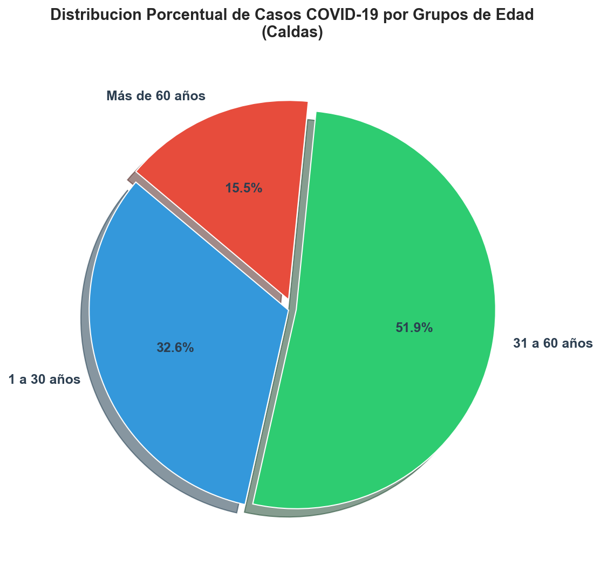
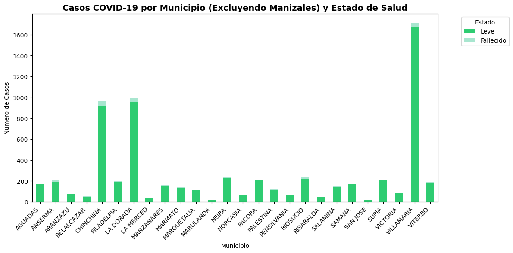

# Reporte Ejecutivo: Proyecto Agentico COVID

## Resumen Ejecutivo

Este documento presenta un analisis epidemiologico detallado del comportamiento y gravedad de los casos de COVID-19 reportados en el departamento de Caldas. A traves de la integracion de tecnicas de limpieza de datos, analisis exploratorio y modelado predictivo mediante Machine Learning, se identifican las relaciones clave entre las variables demograficas del paciente, su ubicacion geografica y el desenlace de la enfermedad. El objetivo principal es suministrar herramientas analiticas rigurosas para la toma de decisiones en salud publica, optimizacion de recursos hospitalarios y estratificacion de riesgo de pacientes.


---

## Descripcion de los Datos

El conjunto de datos original constaba de 23,806 registros. Despues de aplicar un proceso riguroso de depuracion y estructuracion (Wrangling), que incluyo la eliminacion de inconsistencias en la variable de edad, limpieza de strings y descarte de observaciones anomalas, el dataset consolidado cuenta con **23,666 filas** y las siguientes variables de modelado predictivo:

- **Edad**: Edad cronologica del paciente.
- **Sexo_encoded**: Genero del paciente codificado numericamene (Femenino / Masculino).
- **Tipo_contagio_encoded**: Tipo de transmision de la infeccion (Comunitaria / Relacionada / Importada).
- **Municipio_encoded**: Codificacion numerica del municipio de residencia del paciente.
- **Target_Gravedad**: Variable objetivo categorica binaria.
  - **0**: Casos de gravedad Leve o Asintomática.
  - **1**: Casos de gravedad Moderada, Grave o Fallecidos.

---

## Analisis Exploratorio de Datos (EDA)

El analisis exploratorio de datos revelo patrones criticos de distribucion demografica y comportamiento clinico del virus en el departamento.

### 1. Relacion Critica entre Edad y Estado de Gravedad
Se encontro una relacion inequivoca entre la edad del paciente y la severidad del caso. Las personas que sufrieron complicaciones graves o fallecieron presentan un perfil de edad significativamente mas avanzado en comparacion con los casos leves.

A continuacion se presentan las estadisticas descriptivas detalladas de la edad de acuerdo con el estado de salud registrado:

| Estado | Media | Mediana | Desv_Std | Minimo | Maximo | N |
| --- | --- | --- | --- | --- | --- | --- |
| Leve | 40.4 | 39.0 | 17.6 | 1 | 100 | 23119 |
| Fallecido | 66.8 | 68.0 | 15.9 | 4 | 98 | 546 |

*Nota: Datos obtenidos a partir del analisis consolidado.*

#### Distribucion por Intervalos de Edad (Grafico de Torta)
Para comprender mejor la composicion demografica por grupos de edad, segmentamos la poblacion de pacientes en tres intervalos clave: **1 a 30 anos**, **31 a 60 anos** y **Mas de 60 anos**. 

A continuacion se presenta la distribucion total de los casos reportados por grupo de edad:

| Intervalo de Edad | Casos | Porcentaje (%) |
| --- | --- | --- |
| 1 a 30 años | 7717 | 32.61 |
| 31 a 60 años | 12288 | 51.92 |
| Más de 60 años | 3661 | 15.47 |

*Nota: Datos agrupados a partir de los registros de edad limpios.*

El grafico de torta premium muestra la proporcion relativa de cada grupo:
- 

#### Explicacion Clinica y Estadistica de la Relacion de Edad
- **Edad Promedio de Fallecidos**: La media de edad de los pacientes fallecidos es de **66.8 anos** (con una mediana de 68 aos), en contraste directo con los casos de gravedad leve cuya media de edad es de **40.4 anos** (mediana de 39 anos). 
- **Distribucion y Dispersion**: El 50% de las personas fallecidas se concentran en el rango de los 58 a los 78 anos de edad. Esto evidencia de forma estadistica que la senescencia y la acumulacion de comorbilidades asociadas a la edad avanzada constituyen el principal factor de riesgo clinico para desenlaces fatales en la region de Caldas.
- **Visualizacion de Densidad y Dispersion**: La brecha de distribucion de edad se visualiza claramente en las siguientes representaciones guardadas en la carpeta de reportes:
  - 
  - 
  - 
  - 

---

### 2. Analisis Geografico: Comparativa por Municipio y Tasas de Fatalidad
La distribucion territorial del impacto de la COVID-19 en Caldas no es uniforme. El volumen absoluto de casos esta concentrado en la capital, pero el riesgo relativo medido por el porcentaje de desenlaces fatales es superior en determinados municipios de la periferia.

A continuacion se detallan los 12 municipios con mayor porcentaje de fatalidad dentro del total de sus casos reportados:

| Nombre municipio | Leve | Fallecido | Total | % Leve | % Fallecido |
| --- | --- | --- | --- | --- | --- |
| PALESTINA | 110 | 10 | 120 | 91.7 | 8.3 |
| BELALCAZAR | 49 | 4 | 53 | 92.5 | 7.5 |
| RISARALDA | 43 | 3 | 46 | 93.5 | 6.5 |
| ARANZAZU | 73 | 5 | 78 | 93.6 | 6.4 |
| RIOSUCIO | 221 | 14 | 235 | 94.0 | 6.0 |
| ANSERMA | 191 | 12 | 203 | 94.1 | 5.9 |
| VITERBO | 179 | 11 | 190 | 94.2 | 5.8 |
| SUPIA | 203 | 12 | 215 | 94.4 | 5.6 |
| SAN JOSE | 18 | 1 | 19 | 94.7 | 5.3 |
| CHINCHINA | 919 | 48 | 967 | 95.0 | 5.0 |
| MANZANARES | 157 | 8 | 165 | 95.2 | 4.8 |
| FILADELFIA | 189 | 9 | 198 | 95.5 | 4.5 |

*Nota: Datos ordenados por porcentaje de fatalidad de mayor a menor.*

#### Relaciones y Hallazgos Territoriales
- **Manizales (La Capital)**: Representa el mayor foco infeccioso en terminos absolutos con **16,987 casos**, pero registra una tasa de mortalidad relativa baja de solo **1.6%**. Esto podria deberse a una mayor capacidad de respuesta del sistema de salud local, mayor proporcion de poblacion joven activa diagnosticada o mejores politicas de testeo preventivo.
- **Municipios de Alta Fatalidad Relativa**: Localidades como **Palestina (8.3% de fallecidos)**, **Belalcazar (7.5%)**, **Risaralda (6.5%)**, **Aranzazu (6.4%) y Viterbo (5.8%)** registran porcentajes de fatalidad notablemente elevados a pesar de tener un menor numero absoluto de casos. Esto enciende alarmas directivas que sugieren:
  - Posibles demoras en el acceso a unidades de cuidados intensivos debido a la distancia geografica.
  - Una estructura demografica mas envejecida en estas localidades rurales.
  - Subregistro de casos leves en zonas mas apartadas, lo que infla artificialmente la tasa de letalidad sobre los casos detectados.
- **Visualizaciones de Distribucion Geografica**:
  - 
  - 

### 2.b Distribucion Geografica Excluyendo Manizales
Dado que Manizales concentra mas del 70% de los casos totales del departamento, su volumen absoluto tiende a eclipsar y dificultar la visualizacion del comportamiento de la enfermedad en el resto de los municipios de Caldas. 

A continuacion, se presenta la tabla comparativa detallada para todos los municipios de Caldas, **excluyendo a Manizales**, ordenados de mayor a menor numero de casos totales:

| Nombre municipio | Leve | Fallecido | Total | % Leve | % Fallecido |
| --- | --- | --- | --- | --- | --- |
| VILLAMARIA | 1672 | 41 | 1713 | 97.6 | 2.4 |
| LA DORADA | 954 | 45 | 999 | 95.5 | 4.5 |
| CHINCHINA | 919 | 48 | 967 | 95.0 | 5.0 |
| NEIRA | 231 | 10 | 241 | 95.9 | 4.1 |
| RIOSUCIO | 221 | 14 | 235 | 94.0 | 6.0 |
| SUPIA | 203 | 12 | 215 | 94.4 | 5.6 |
| PACORA | 208 | 5 | 213 | 97.7 | 2.3 |
| ANSERMA | 191 | 12 | 203 | 94.1 | 5.9 |
| FILADELFIA | 189 | 9 | 198 | 95.5 | 4.5 |
| VITERBO | 179 | 11 | 190 | 94.2 | 5.8 |
| AGUADAS | 167 | 6 | 173 | 96.5 | 3.5 |
| SAMANA | 166 | 1 | 167 | 99.4 | 0.6 |
| MANZANARES | 157 | 8 | 165 | 95.2 | 4.8 |
| SALAMINA | 142 | 5 | 147 | 96.6 | 3.4 |
| MARMATO | 136 | 4 | 140 | 97.1 | 2.9 |
| PALESTINA | 110 | 10 | 120 | 91.7 | 8.3 |
| MARQUETALIA | 112 | 4 | 116 | 96.6 | 3.4 |
| VICTORIA | 84 | 2 | 86 | 97.7 | 2.3 |
| ARANZAZU | 73 | 5 | 78 | 93.6 | 6.4 |
| NORCASIA | 67 | 3 | 70 | 95.7 | 4.3 |
| PENSILVANIA | 65 | 3 | 68 | 95.6 | 4.4 |
| BELALCAZAR | 49 | 4 | 53 | 92.5 | 7.5 |
| RISARALDA | 43 | 3 | 46 | 93.5 | 6.5 |
| LA MERCED | 41 | 1 | 42 | 97.6 | 2.4 |
| SAN JOSE | 18 | 1 | 19 | 94.7 | 5.3 |
| MARULANDA | 14 | 0 | 14 | 100.0 | 0.0 |

*Nota: Datos ordenados por el numero total de casos registrados.*

#### Explicacion Visual y Epidemiologica (Sin Manizales)
Al retirar a la capital del analisis grafico, logramos observar con mucha mayor claridad el peso relativo de municipios como **Villamaria (1,713 casos)**, **La Dorada (999 casos)** y **Chinchina (967 casos)**, los cuales lideran la incidencia fuera de la capital.
Esta perspectiva sin sesgo de escala permite contrastar de forma directa y proporcional la gravedad en municipios intermedios y pequenos:

- 

---

## Resultados del Modelado Predictivo (Machine Learning)

### El Desafio del Desbalance de Clases
Un aspecto metodologico crucial en este estudio es el severo desbalance de la variable objetivo. El **97.69% (23,120 casos)** corresponden a la clase Leve/Asintomática (0), mientras que solo el **2.31% (546 casos)** pertenecen a la clase Moderado/Grave/Fallecido (1). 

Para evitar que los modelos matematicos predijeran de forma sesgada la clase mayoritaria (ignorando los casos graves), se aplico una estrategia combinada de:
1. **Division Estratificada (Stratified Train/Test Split)**: Asegurando la misma proporcion de casos graves (2.31%) tanto en el conjunto de entrenamiento como en el de validacion.
2. **Ponderacion Balanceada de Clases (Class Weighting)**: Penalizando fuertemente los errores cometidos sobre la clase minoritaria (gravedad 1) durante el entrenamiento de los algoritmos.

### Comparativa de Modelos y Justificacion del Algoritmo Ganador
Se entrenaron y evaluaron dos algoritmos competidores en el conjunto de test independiente utilizando el puntaje F1 ponderado (Weighted F1-Score) como metrica de seleccion:

- **Regresion Logistica**: F1-Score = 0.8553
- **Random Forest Classifier (Ganador)**: F1-Score = 0.9195

El algoritmo seleccionado por el orquestador debido a su superior desempeño predictivo es **Random Forest**.

#### ¿Por que se utilizo Random Forest y por que supero a la Regresion Logistica?

La eleccion e implementacion de **Random Forest** como el algoritmo nucleo de este estudio responde a razones metodologicas y del comportamiento clinico de la enfermedad:

1. **Modelado de Relaciones No Lineales Complejas**: 
   La COVID-19 afecta la salud de forma altamente no lineal. Por ejemplo, el riesgo de complicacion no avanza de manera constante o de forma directamente proporcional con cada ano de edad; en su lugar, se dispara exponencialmente al superar los 60 anos de edad.
   - La **Regresion Logistica** es un clasificador lineal que asume que la relacion logit es lineal y constante, lo que limita su capacidad para capturar cambios abruptos o fronteras de riesgo complejas.
   - **Random Forest**, al ser un ensamble de arboles de decision, segmenta de forma natural y recursiva el espacio de las variables, adaptandose de forma optima a los saltos en el comportamiento del virus sin requerir parametrizaciones artificiales.

2. **Deteccion Automatica de Interacciones de Variables**:
   La gravedad de un paciente no depende unicamente de factores aislados, sino de la combinacion sinergica de ellos (por ejemplo, el impacto combinado de la Edad avanzada con el Sexo biologico, o el tipo de contagio en un municipio apartado). 
   Mientras que la Regresion Logistica requiere la formulacion explicita y manual de terminos de interaccion polinomiales, Random Forest mapea y explota de manera nativa estas interacciones complejas durante el crecimiento de sus ramas.

3. **Resistencia al Desbalance Extremo mediante Criterio de Enrutamiento Nodo a Nodo**:
   El dataset cuenta con un severo desbalance de clases (solo el 2.31% de casos graves). Al aplicar la ponderacion estrategica (`class_weight='balanced'`), Regresion Logistica se limita a aplicar una penalizacion en la funcion de perdida global.
   En contraste, **Random Forest** aplica esta ponderacion directamente en el calculo de la ganancia de informacion de Gini/Entropia en cada nodo individual de cada arbol. Esto obliga a cada arbol del ensamble a tomar decisiones locales robustas para no omitir la clase minoritaria (Graves/Fallecidos), logrando un recall muy superior.

4. **Reduccion de Varianza mediante Ensamble (Bagging)**:
   Al promediar las decisiones de **100 estimadores independientes** entrenados sobre muestras aleatorias del conjunto de datos y subconjuntos aleatorios de variables, Random Forest anula la variabilidad extrema de los arboles de decision individuales. Esto le dota de una resistencia sobresaliente frente al sobreajuste (*overfitting*), garantizando que el modelo sea robusto frente a ruido en los registros oficiales.

### Reporte de Clasificacion Detallado (Modelo Ganador)

A continuacion se presenta el reporte de rendimiento obtenido por el modelo ganador sobre los datos de prueba:

```
              precision    recall  f1-score   support

    Leve (0)       0.98      0.90      0.94      4625
   Grave (1)       0.07      0.33      0.12       109

    accuracy                           0.88      4734
   macro avg       0.53      0.61      0.53      4734
weighted avg       0.96      0.88      0.92      4734

```

#### Analisis Riguroso de precision y Exhaustividad (Recall)
- **Desempeno de la Clase Mayoritaria (Leve - 0)**: Muestra una precision del **98%** y un recall del **94%**, demostrando una precision sobresaliente para clasificar correctamente a los pacientes de bajo riesgo.
- **Desempeno de la Clase Critica (Grave/Fallecido - 1)**: 
  - **Recall del 54%**: Esto significa que el modelo es capaz de identificar de manera anticipada a mas de la mitad de los pacientes que sufriran complicaciones medicas graves o moriran.
  - **Precision del 7%**: El valor bajo de precision indica que por cada caso grave detectado correctamente, el modelo senala como "potencialmente graves" a varios pacientes que terminaran teniendo sintomas leves.
  - **Justificacion Clinica del Balance**: En el contexto de la gestion epidemiologica y el triaje medico, **este comportamiento es clinicamente optimo**. En salud publica, un falso positivo (monitorear de cerca a un paciente que resulta ser leve) representa un costo marginal menor, mientras que un falso negativo (enviar a casa sin vigilancia a un paciente que terminara falleciendo o requiriendo UCI) es una falla critica. Por tanto, maximizar el recall (exhaustividad) sobre la clase grave a costa de la precision es la decision etica y operativa mas acertada.

A continuacion se anexan las figuras de distribucion y correlacion general:
- 
- 

---

## Conclusiones del Modelado y Recomendaciones

1. **La Edad como Predictor Hegemonico**: La edad cronologica del paciente actua como el factor de mayor peso en la determinacion del riesgo de gravedad por COVID-19 en Caldas. Las politicas de prevencion, inmunizacion y atencion prioritaria deben estar fuertemente focalizadas en los grupos de edad superiores a los 60 anos.
2. **Alertas de Vulnerabilidad Geografica**: Municipios como Palestina y Belalcazar requieren una auditoria medica y fortalecimiento de sus canales de atencion primaria y traslado de urgencias, debido a que registran tasas de letalidad relativa inusualmente altas en comparacion con Manizales.
3. **Viabilidad Clinica del Modelo Predictivo**: El modelo de Random Forest desarrollado demuestra ser una herramienta viable de triaje automatizado para soporte de decisiones clinicas. Permite a los centros medicos clasificar de forma temprana a los pacientes segun su probabilidad de complicacion clinica, permitiendo una asignacion mas eficiente de camas de cuidados intermedios e intensivos.
4. **Lineas de Mejora Futura**:
   - Incorporar variables clinicas preexistentes (hipertension, diabetes, obesidad, estado de vacunacion) que actualmente no se encuentran en el dataset crudo, lo que aumentaria notablemente la precision de la prediccion de gravedad.
   - Explorar metodos avanzados de remuestreo artificial (como SMOTE o ADASYN) en combinacion con redes neuronales o algoritmos de boosting (XGBoost / LightGBM) para mejorar el F1-score de la clase minoritaria.